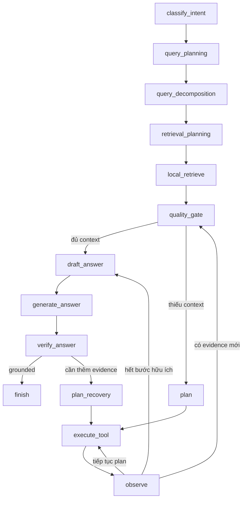
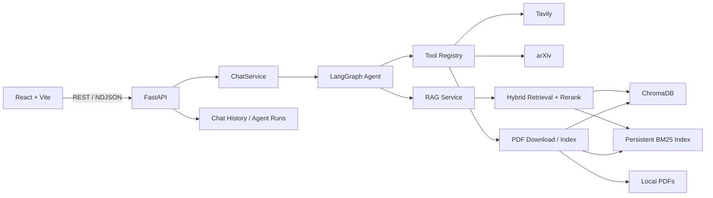

# AI Research Assistant

AI Research Assistant là một ứng dụng **Agentic RAG cho nghiên cứu học thuật**. Hệ thống cho phép người dùng upload paper PDF, index nội dung, đặt câu hỏi trong giao diện chat, nhận câu trả lời có citation, và quan sát toàn bộ quá trình agent lập kế hoạch, truy xuất, gọi tool, kiểm chứng câu trả lời.

Điểm chính của project là chứng minh một RAG system có tính agentic thật, không chỉ là pipeline `retrieve -> prompt -> generate`. Agent có state, decision points, tool selection, retry/fallback policy, stopping condition, grounding verification và benchmark so sánh với các baseline RAG đơn giản hơn.

## Demo Use Case

Người dùng có thể:

1. Upload hoặc index paper PDF.
2. Hỏi câu hỏi về một hoặc nhiều paper.
3. Xem câu trả lời kèm citation theo chunk/page.
4. Theo dõi agent trace: query planning, retrieval, quality gate, tool call, verification.
5. Khi local evidence chưa đủ, agent có thể mở rộng bằng web search, arXiv search, PDF download và PDF indexing.

## Công Nghệ Sử Dụng

| Nhóm | Công nghệ |
| --- | --- |
| Frontend | React 19, Vite 7, Lucide React |
| Backend | Python 3.11+, FastAPI, Pydantic, Uvicorn |
| Agent workflow | LangGraph |
| LLM / Embedding | OpenAI API |
| Vector database | ChromaDB |
| Keyword search | Persistent BM25 index |
| Reranking | Sentence Transformers cross-encoder, heuristic fallback |
| PDF processing | PyMuPDF |
| External tools | Tavily Web Search, arXiv |
| Observability | JSON logs, request ID, W3C `traceparent`, optional OpenTelemetry |
| Testing | Pytest, Ruff, ESLint, Vite build |
| Deployment | Docker, Docker Compose |

## Kỹ Thuật Chính

### 1. Agentic Control Flow

Backend dùng LangGraph để điều phối workflow:



Các stopping condition được trace rõ ràng, ví dụ:

- `answered_with_sufficient_context`
- `answered_after_recovery`
- `web_search_disabled`
- `planner_no_valid_steps`
- `step_limit_reached`
- `tool_limit_reached`
- `verification_failed_answer_unknown`

### 2. Planning Và Tool Selection

Agent có planner tạo `PlannerDecision` có cấu trúc, chọn tool dựa trên intent, context quality và cấu hình request.

Tool registry hiện có:

| Tool | Chức năng |
| --- | --- |
| `local_retrieve` | Truy xuất từ local PDF index. |
| `web_search` | Tìm kiếm web khi local context thiếu hoặc cần thông tin mới. |
| `web_snippet_ingest` | Lưu snippet web vào index để tái sử dụng. |
| `arxiv_search` | Tìm paper mới trên arXiv. |
| `pdf_download` | Download PDF được phát hiện. |
| `pdf_index` | Parse, chunk, embed và index PDF mới. |

Planner có heuristic fallback và optional LLM planner qua `ENABLE_LLM_PLANNER=true`.

### 3. Retrieval Pipeline

Retrieval không chỉ dùng vector search đơn giản:

- Query rewriting và query decomposition.
- Retrieval planning theo query type: simple lookup, comparison, multi-aspect, paper review.
- ChromaDB vector search.
- Persistent BM25 keyword index.
- Hybrid scoring giữa vector và keyword.
- Cross-encoder reranking với heuristic fallback.
- Chunk budget và threshold được điều chỉnh theo loại câu hỏi.

### 4. Chunking Và Indexing

PDF được parse bằng PyMuPDF, sau đó chunk theo trang và section. Chunk metadata có thể lưu thông tin như:

- `paper_id`
- `title`
- `page_number`
- `chunk_id`
- `section`
- `section_type`
- `source_type`
- `trust_level`

Thiết kế này giúp retrieval và citation trace rõ ràng hơn khi review kết quả.

### 5. Grounding, Citation Và Verification

Answer generation bắt buộc dùng citation theo `chunk_id`. Sau khi sinh câu trả lời, verifier kiểm tra:

- Citation có tồn tại trong retrieved context không.
- Claim có được citation support không.
- Claim có dấu hiệu contradicted hoặc insufficient không.
- Câu trả lời có cần revise, retrieve more hoặc trả `I don't know` không.

Frontend có claim-level citation map, giúp xem claim nào được support bởi chunk nào.

### 6. Retry, Fallback Và Recovery

Khi local retrieval không đủ context:

1. Agent retry local retrieval với `top_k` cao hơn và threshold thấp hơn.
2. Nếu vẫn thiếu và web được bật, agent gọi `web_search`.
3. Với câu hỏi cần thông tin mới, agent có thể dùng `arxiv_search`, `pdf_download`, `pdf_index`, rồi retrieve lại.
4. Nếu verifier phát hiện unsupported claim, agent có thể lập recovery plan.

Các vòng lặp đều có limit để tránh chạy vô hạn.

### 7. Security Và Observability

Security đã triển khai:

- SSRF protection cho PDF download.
- PDF upload/download size limit.
- PDF header/content-type validation.
- Optional domain allowlist cho PDF download.
- Prompt-injection detection trong retrieved context.
- Prompt boundary: retrieved context được coi là untrusted data.
- Optional API key auth.
- Optional tenant enforcement bằng `X-Tenant-ID`.
- Tenant-scoped local chat/run storage.
- Tenant-aware in-memory rate limiting.
- Secret-file loading qua `*_FILE` env vars.

Observability:

- `X-Request-ID`
- W3C `traceparent`
- `X-Trace-ID`, `X-Span-ID`
- JSON request logs
- Structured stream error events
- Agent trace với latency, token usage, embedding usage và estimated cost
- Optional OpenTelemetry FastAPI instrumentation

## Kiến Trúc Tổng Quan



## Benchmark

Project có evaluation harness trong `backend/evals/` để so sánh 4 chế độ:

| Mode | Mô tả |
| --- | --- |
| `vector_only_rag` | Chỉ dùng vector search, không BM25, không rerank, không agent. |
| `hybrid_rag` | Vector + BM25, không reranker, không agent. |
| `hybrid_rerank_rag` | Hybrid retrieval + reranking, không agent recovery. |
| `full_agentic_rag` | Toàn bộ LangGraph Agentic RAG workflow. |

### Kết Quả Live Benchmark

Artifact:

- `backend/evals/results/live_results.json`
- `backend/evals/results/live_report.md`

Dataset gồm 110 cases, bao gồm factual, comparison, multi-hop, follow-up, unanswerable, fresh-context và adversarial/citation-trap scenarios.

| Mode | Cases | Answer recall | Citation precision | Retrieval recall | Errors |
| --- | ---: | ---: | ---: | ---: | ---: |
| `vector_only_rag` | 110 | 0.545 | 0.727 | 0.591 | 0 |
| `hybrid_rag` | 110 | 0.727 | 0.909 | 0.909 | 0 |
| `hybrid_rerank_rag` | 110 | 0.864 | 0.864 | 0.909 | 0 |
| `full_agentic_rag` | 110 | 0.982 | 0.991 | 0.991 | 0 |

So với `hybrid_rerank_rag`, full agentic mode cải thiện:

- Answer recall: `+0.118`
- Citation precision: `+0.127`
- Citation recall: `+0.082`
- Retrieval recall: `+0.082`
- Abstention accuracy: `+0.082`

Trade-off: full agentic mode có latency và estimated cost cao hơn do thêm planning, tool recovery và verification.

### Chạy Benchmark

Deterministic offline benchmark, không cần external API:

```bash
cd backend
python evals/run_eval.py --profile offline_fixture --mode all --output evals/results/offline_fixture_results.json --report-output evals/results/offline_fixture_report.md
```

Local fixture benchmark với temporary Chroma index:

```bash
cd backend
python evals/run_eval.py --dataset tests/fixtures/eval_cases.jsonl --profile local_fixture --mode all --output evals/results/local_fixture_results.json --report-output evals/results/local_fixture_report.md
```

Live benchmark:

```bash
cd backend
python evals/run_eval.py --profile live --mode all --output evals/results/live_results.json --report-output evals/results/live_report.md
```

Live benchmark có preflight kiểm tra `OPENAI_API_KEY`, Chroma corpus và fresh-context search requirements.

## Cài Đặt Và Chạy

### Backend

PowerShell:

```powershell
cd backend
python -m venv .venv
.\.venv\Scripts\Activate.ps1
pip install -e ".[dev]"
Copy-Item .env.example .env
python -m app.main
```

macOS/Linux:

```bash
cd backend
python -m venv .venv
source .venv/bin/activate
pip install -e ".[dev]"
cp .env.example .env
python -m app.main
```

Điền tối thiểu `OPENAI_API_KEY` trong `backend/.env`.

Backend:

- API: `http://localhost:8000/api/v1`
- Swagger: `http://localhost:8000/docs`
- Health: `http://localhost:8000/api/v1/health`

### Frontend

```bash
cd frontend
npm ci
npm run dev
```

Frontend chạy tại:

```text
http://localhost:5173
```

### Docker

```bash
cp backend/.env.example backend/.env
docker compose up --build
```

PowerShell:

```powershell
Copy-Item backend/.env.example backend/.env
docker compose up --build
```

Services:

| Service | URL |
| --- | --- |
| Frontend | `http://localhost:5173` |
| Backend API | `http://localhost:8000/api/v1` |
| Swagger | `http://localhost:8000/docs` |

## Kiểm Thử

Backend:

```bash
cd backend
pytest -q
ruff check .
```

Frontend:

```bash
cd frontend
npm run lint
npm run build
```

Docker config:

```bash
docker compose config --quiet
```

Trạng thái verification hiện tại:

- `pytest -q`: 258 passed, 1 warning
- `ruff check .`: passed
- `npm run lint`: passed
- `npm run build`: passed
- `docker compose config --quiet`: passed

## Cấu Trúc Thư Mục

```text
AI Research Assistant/
├── backend/
│   ├── app/
│   │   ├── agent/
│   │   ├── api/
│   │   ├── config/
│   │   ├── middleware/
│   │   ├── observability/
│   │   ├── parser/
│   │   ├── services/
│   │   ├── storage/
│   │   └── vectorstore/
│   ├── docs/
│   ├── evals/
│   └── tests/
├── frontend/
├── docker-compose.yml
└── AGENTIC_RAG_IMPROVEMENT_PLAN.md
```

## Tài Liệu Bổ Sung

- `AGENTIC_RAG_IMPROVEMENT_PLAN.md`
- `backend/docs/agentic_design.md`
- `backend/docs/architecture.md`
- `backend/docs/workflow.md`
- `backend/docs/evaluation.md`
- `backend/docs/security.md`
- `backend/docs/deployment.md`
