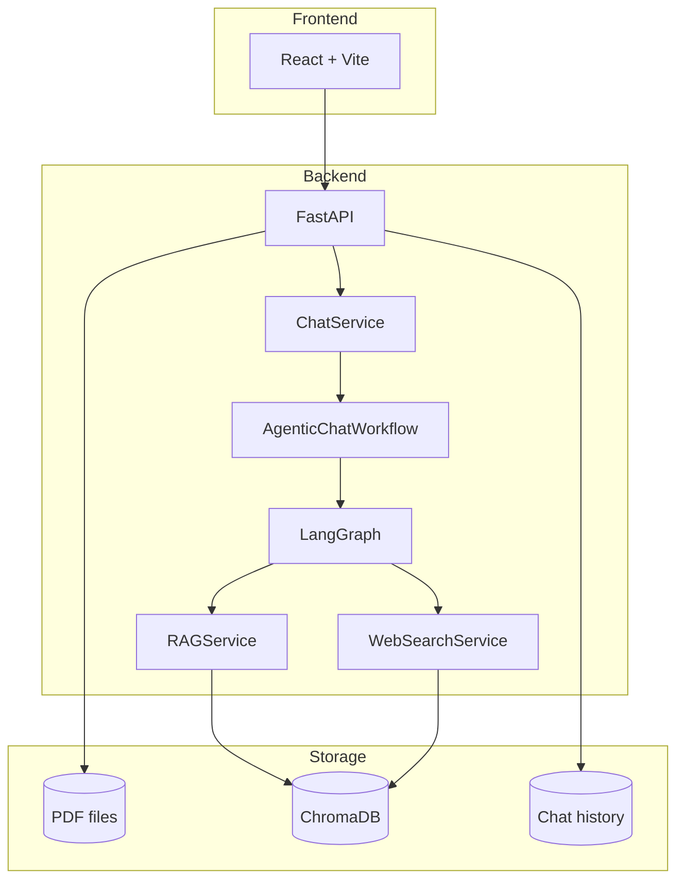

# AI Research Assistant

Trợ lý nghiên cứu học thuật giúp quản lý paper PDF local, hỏi đáp có trích dẫn (RAG), và bổ sung tri thức từ web khi knowledge base chưa đủ.

## Tính năng

- **Thư viện tri thức** — xem danh sách PDF, xem chi tiết, tải file lên
- **Chat với AI** — giao diện hội thoại, streaming, quản lý session và nguồn paper
- **RAG trên PDF** — parse, chunk, embed vào ChromaDB; hybrid retrieval (vector + BM25) + rerank
- **Agentic RAG** — LangGraph quyết định khi nào cần web search
- **Web search fallback** — Tavily tìm tri thức liên quan và lưu snippet vào vector store

## Kiến trúc tổng quan



### Luồng Agentic RAG (chat)

```
local_retrieve → quality_gate → answer
                      ↓ (context không đủ)
                 web_search → knowledge_ingest → answer
```

| Node | Mô tả |
|------|--------|
| `local_retrieve` | Retrieve chunk từ ChromaDB (theo `paper_ids` hoặc toàn bộ index) |
| `quality_gate` | Đánh giá đủ context: score, coverage, câu hỏi cần thông tin mới, LLM self-check |
| `web_search` | Gọi Tavily với câu hỏi user, tạo chunk `web:1`, `web:2`... |
| `knowledge_ingest` | Index snippet web vào ChromaDB cho lần retrieve sau |
| `answer` | Ghép context, build prompt + citations; LLM generate bên ngoài graph |

## Công nghệ

| Layer | Stack |
|-------|-------|
| Frontend | React 19, Vite, Lucide icons |
| Backend | FastAPI, LangGraph, OpenAI API |
| Vector store | ChromaDB |
| PDF | PyMuPDF |
| Retrieval | Hybrid vector + BM25, cross-encoder rerank |
| Web search | Tavily API |

## Cấu trúc thư mục

```
AI Research Assistant/
├── frontend/          # React app
│   └── src/
│       ├── pages/     # Home, Paper detail, Chat
│       └── api.js     # API client
├── backend/
│   ├── app/
│   │   ├── agent/     # LangGraph + nodes
│   │   ├── api/       # FastAPI routes
│   │   ├── parser/    # PDF parse, chunk, clean
│   │   ├── services/  # RAG, chat, web search, LLM...
│   │   ├── storage/   # Chat history, metadata
│   │   └── vectorstore/
│   ├── data/          # PDFs, Chroma, chunks (local)
│   ├── docs/          # API & workflow notes
│   └── tests/
└── README.md
```

## Yêu cầu

- Python 3.11+
- Node.js 18+
- OpenAI API key (bắt buộc cho chat/embed)
- Tavily API key (tùy chọn — bật web search fallback)

## Cài đặt & chạy

### Backend

```bash
cd backend
python -m venv .venv
.venv\Scripts\activate        # Windows
# source .venv/bin/activate   # macOS/Linux
pip install -e ".[dev]"
cp .env.example .env          # điền API keys
python -m app.main
```

API chạy tại `http://localhost:8000`. Health check:

```bash
curl http://localhost:8000/api/v1/health
```

### Frontend

```bash
cd frontend
npm install
npm run dev
```

UI tại `http://localhost:5173`. Mặc định gọi API `http://localhost:8000/api/v1` (có thể đổi qua `VITE_API_BASE_URL`).

### Thêm paper

1. Tải PDF qua UI (nút **Tải PDF lên**), hoặc
2. Copy file vào `backend/data/pdfs/`, rồi restart backend (tự index nếu `INDEX_LOCAL_PDFS_ON_STARTUP=true`)

## Biến môi trường

Tạo `backend/.env` từ `.env.example`:

| Biến | Mô tả |
|------|--------|
| `OPENAI_API_KEY` | Key OpenAI — chat + embedding |
| `TAVILY_API_KEY` | Key Tavily — web search (lấy tại [tavily.com](https://tavily.com)) |
| `DATA_DIR` | Thư mục dữ liệu (mặc định `data`) |
| `CHROMA_DIR` | Thư mục ChromaDB (mặc định `data/chroma`) |
| `INDEX_LOCAL_PDFS_ON_STARTUP` | Tự index PDF local khi khởi động (`true`/`false`) |

## API chính

Base path: `/api/v1`

| Method | Endpoint | Mô tả |
|--------|----------|--------|
| `GET` | `/health` | Health check |
| `GET` | `/papers/pdfs` | Danh sách PDF local |
| `POST` | `/papers/pdfs/upload` | Upload PDF |
| `POST` | `/papers/pdfs/index` | Index một PDF |
| `POST` | `/chat` | Chat (JSON response) |
| `POST` | `/chat/stream` | Chat streaming (NDJSON) |
| `GET/POST` | `/chat/sessions` | Quản lý phiên chat |
| `GET` | `/chat/history` | Danh sách hội thoại |

Chi tiết thêm: [`backend/docs/api.md`](backend/docs/api.md), [`backend/docs/workflow.md`](backend/docs/workflow.md).

## Kiểm thử

```bash
cd backend
pytest
```

## Scripts hữu ích

```bash
cd backend
python scripts/ingest.py      # Index PDF thủ công
python scripts/reindex.py     # Re-index toàn bộ
python scripts/clean_data.py  # Dọn dữ liệu local
```

## Docker (tùy chọn)

```bash
cd backend/docker
docker compose up
```

Xem [`backend/docker/docker-compose.yml`](backend/docker/docker-compose.yml).
