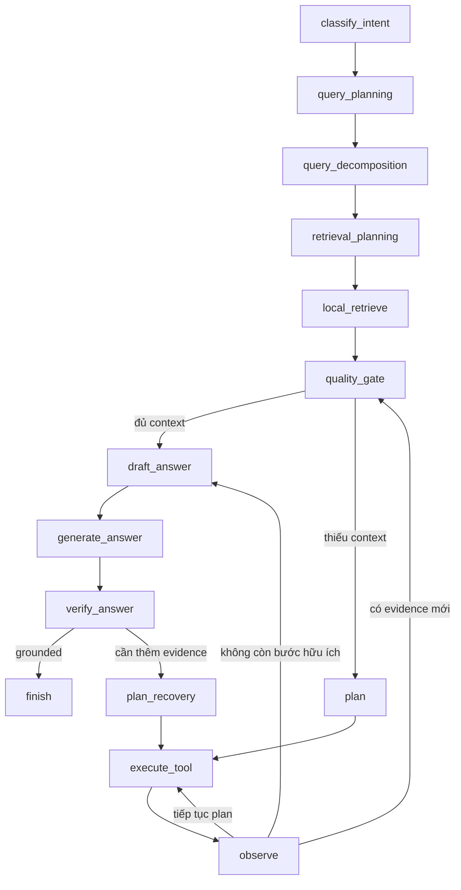
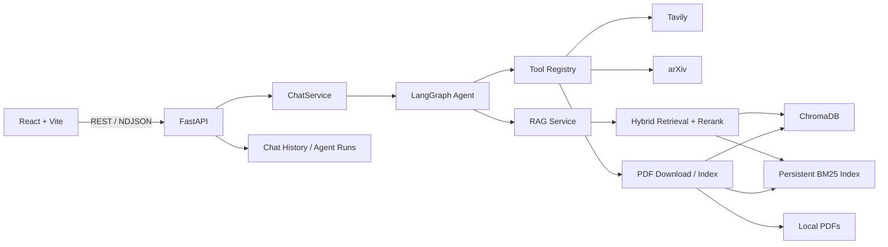

# AI Research Assistant

AI Research Assistant là một ứng dụng Agentic RAG dùng để đọc paper PDF, trả lời câu hỏi nghiên cứu có trích dẫn, và tự mở rộng bằng chứng qua local retrieval, web search, arXiv, download PDF và re-index khi dữ liệu cục bộ chưa đủ.

Repo này được viết như một project portfolio cho hướng LLM/RAG/Agentic Systems: hệ thống có agent state rõ ràng, decision points, tool routing, retry limit, stop reason, grounding verification, citation trace, benchmark baseline, cost/latency tracking, observability và security hardening.

## Vì Sao Đây Là Agentic RAG

Đây không chỉ là một RAG pipeline cố định được bọc thêm LLM. Backend dùng LangGraph để điều khiển workflow có trạng thái và nhánh quyết định rõ ràng:



Bằng chứng agentic trong code:

- `planner_node.py` tạo `PlannerDecision` có cấu trúc và validate tool được chọn qua registry.
- `query_planning_node.py` điều chỉnh retrieval mode, query decomposition, `top_k`, score threshold và chunk budget.
- `quality_gate_node.py` quyết định context đã đủ trước khi sinh câu trả lời.
- `tool_executor_node.py` chạy tool với timeout, latency trace, retry limit và cost trace.
- `verify_answer_node.py` kiểm tra citation/claim và có thể kích hoạt recovery.
- `graph.py` định nghĩa stopping condition như `answered_with_sufficient_context`, `answered_after_recovery`, `web_search_disabled`, `step_limit_reached`, `tool_limit_reached`, `verification_failed_answer_unknown`.

Các tool của agent:

| Tool | Vai trò |
| --- | --- |
| `local_retrieve` | Truy xuất từ PDF đã index bằng hybrid retrieval. |
| `web_search` | Tìm kiếm web bằng Tavily khi local context thiếu. |
| `web_snippet_ingest` | Lưu snippet web hữu ích vào index theo phạm vi chat. |
| `arxiv_search` | Tìm paper mới trên arXiv. |
| `pdf_download` | Tải PDF được phát hiện một cách an toàn. |
| `pdf_index` | Parse, chunk, embed và index PDF đã tải. |

## Tính Năng Chính

- Upload, preview, index và quản lý PDF cục bộ.
- Chunking theo section của paper học thuật.
- ChromaDB vector search kết hợp persistent BM25 keyword index.
- Hybrid retrieval, query rewriting, query decomposition và optional cross-encoder reranking.
- Agent trace UI hiển thị planning, retrieval, tool calls, observation, verification và stop reason.
- Claim-level citation map: mỗi claim được nối với các chunk citation hỗ trợ.
- Semantic verification bằng heuristic claim judge và optional LLM claim judge.
- Local retry với threshold thấp hơn trước khi fallback sang web.
- Web/arXiv/PDF recovery path cho câu hỏi thiếu evidence hoặc cần thông tin mới.
- Agent run history lưu latency, token usage, embedding usage, estimated cost, citations, findings và trace.
- Request correlation qua `X-Request-ID`, W3C `traceparent`, `X-Trace-ID`, `X-Span-ID`.
- Optional API key auth, tenant enforcement, tenant-scoped local storage và rate-limit headers.
- SSRF protection, PDF size/header validation, prompt-injection marking và untrusted-context prompting.
- Evaluation harness với baseline `vector_only`, `hybrid`, `hybrid_rerank` và `full_agentic`.

## Kiến Trúc



## Evaluation

Repo có evaluation harness trong `backend/evals/` để so sánh full agentic workflow với các baseline RAG đơn giản hơn.

Artifact benchmark live hiện có:

- `backend/evals/results/live_results.json`
- `backend/evals/results/live_report.md`

Tóm tắt 110 cases:

| Mode | Cases | Answer recall | Citation precision | Retrieval recall | Errors |
| --- | ---: | ---: | ---: | ---: | ---: |
| `vector_only_rag` | 110 | 0.545 | 0.727 | 0.591 | 0 |
| `hybrid_rag` | 110 | 0.727 | 0.909 | 0.909 | 0 |
| `hybrid_rerank_rag` | 110 | 0.864 | 0.864 | 0.909 | 0 |
| `full_agentic_rag` | 110 | 0.982 | 0.991 | 0.991 | 0 |

Kết quả cho thấy full agentic mode cải thiện answer recall, citation precision, retrieval recall và abstention behavior so với các baseline không agentic, đổi lại latency/cost cao hơn.

Chạy deterministic eval không cần external API:

```bash
cd backend
python evals/run_eval.py --profile offline_fixture --mode all --output evals/results/offline_fixture_results.json --report-output evals/results/offline_fixture_report.md
```

Chạy local fixture eval với temporary Chroma index:

```bash
cd backend
python evals/run_eval.py --dataset tests/fixtures/eval_cases.jsonl --profile local_fixture --mode all --output evals/results/local_fixture_results.json --report-output evals/results/local_fixture_report.md
```

Chạy live eval:

```bash
cd backend
python evals/run_eval.py --profile live --mode all --output evals/results/live_results.json --report-output evals/results/live_report.md
```

Live eval có preflight để kiểm tra `OPENAI_API_KEY`, Chroma corpus và yêu cầu external search cho fresh-context cases.

## Tech Stack

| Layer | Công nghệ |
| --- | --- |
| Frontend | React 19, Vite 7, Lucide React |
| Backend | Python 3.11+, FastAPI, Pydantic, Uvicorn |
| Agent | LangGraph |
| LLM / Embedding | OpenAI API |
| Vector DB | ChromaDB |
| Keyword Search | Persistent BM25 index |
| Reranking | Sentence Transformers cross-encoder, heuristic fallback |
| PDF Processing | PyMuPDF |
| External Research | Tavily, arXiv |
| Observability | JSON logs, request ID, traceparent, optional OpenTelemetry |
| Testing | Pytest, Ruff, ESLint, Vite build |

## Cấu Trúc Dự Án

```text
AI Research Assistant/
├── backend/
│   ├── app/
│   │   ├── agent/          # LangGraph nodes, state, tools, verifier, prompts
│   │   ├── api/            # FastAPI routers, dependencies, auth/rate limit middleware
│   │   ├── config/         # Settings và JSON logging
│   │   ├── middleware/     # Request ID và trace context middleware
│   │   ├── observability/  # traceparent và optional OpenTelemetry setup
│   │   ├── parser/         # PDF parsing và chunking
│   │   ├── services/       # LLM, embedding, RAG, retrieval, PDF, web, arXiv
│   │   ├── storage/        # Chat history và agent run persistence
│   │   └── vectorstore/    # Chroma và keyword index
│   ├── docs/               # Architecture, workflow, evaluation, security, deployment
│   ├── evals/              # Evaluation harness, dataset, reports
│   └── tests/
├── frontend/
│   └── src/
│       ├── components/
│       ├── pages/
│       └── utils/
├── docker-compose.yml
└── AGENTIC_RAG_IMPROVEMENT_PLAN.md
```

## Yêu Cầu

- Python 3.11+
- Node.js `^20.19.0` hoặc `>=22.12.0`
- Docker và Docker Compose nếu chạy bằng container
- OpenAI API key cho LLM và embeddings
- Tavily API key nếu dùng web-search recovery

## Chạy Local

### Backend

PowerShell:

```powershell
cd backend
python -m venv .venv
.\.venv\Scripts\Activate.ps1
pip install -e ".[dev]"
Copy-Item .env.example .env
python -m app.main
```

macOS/Linux:

```bash
cd backend
python -m venv .venv
source .venv/bin/activate
pip install -e ".[dev]"
cp .env.example .env
python -m app.main
```

Điền ít nhất `OPENAI_API_KEY` trong `backend/.env`.

Backend URLs:

- API: `http://localhost:8000/api/v1`
- Swagger UI: `http://localhost:8000/docs`
- Health: `http://localhost:8000/api/v1/health`

### Frontend

```bash
cd frontend
npm ci
npm run dev
```

Frontend chạy tại `http://localhost:5173`.

Nếu muốn đổi backend URL:

```env
VITE_API_BASE_URL=http://localhost:8000/api/v1
```

## Docker

Từ thư mục gốc:

```bash
cp backend/.env.example backend/.env
docker compose up --build
```

PowerShell:

```powershell
Copy-Item backend/.env.example backend/.env
docker compose up --build
```

Services:

| Service | URL |
| --- | --- |
| Frontend | `http://localhost:5173` |
| Backend API | `http://localhost:8000/api/v1` |
| Swagger UI | `http://localhost:8000/docs` |

Root compose chỉ mount runtime data vào backend container:

```text
backend/data:/app/data
```

Source backend không bị bind-mount đè lên `/app`, nên container chạy đúng image artifact đã build.

## Biến Môi Trường

Backend đọc `backend/.env`.

| Variable | Default | Ý nghĩa |
| --- | --- | --- |
| `OPENAI_API_KEY` | empty | OpenAI key cho LLM và embeddings |
| `OPENAI_API_KEY_FILE` | empty | File path cho mounted OpenAI secret |
| `TAVILY_API_KEY` | empty | Tavily key cho web search |
| `TAVILY_API_KEY_FILE` | empty | File path cho mounted Tavily secret |
| `API_KEY` | empty | Optional backend API key |
| `API_KEY_FILE` | empty | File path cho mounted backend API key |
| `REQUIRE_TENANT_ID` | `false` | Yêu cầu `X-Tenant-ID` hợp lệ cho protected endpoints |
| `API_RATE_LIMIT_PER_MINUTE` | `0` | In-memory request limit; `0` là tắt |
| `LOG_LEVEL` | `INFO` | Backend log level |
| `CORS_ALLOW_ORIGINS` | localhost origins | CORS allowlist, phân tách bằng dấu phẩy |
| `DATA_DIR` | `data` | Thư mục runtime data |
| `CHROMA_DIR` | `data/chroma` | Thư mục ChromaDB |
| `MAX_PDF_DOWNLOAD_BYTES` | `52428800` | Giới hạn kích thước PDF tải từ URL |
| `MAX_PDF_UPLOAD_BYTES` | `26214400` | Giới hạn kích thước PDF upload |
| `PDF_DOWNLOAD_ALLOWED_DOMAINS` | empty | Optional allowlist domain cho PDF download |
| `ENABLE_LLM_PLANNER` | `false` | Bật LLM JSON planner, có heuristic fallback |
| `ENABLE_LLM_VERIFIER` | `false` | Bật LLM claim judge, có heuristic fallback |
| `OTEL_ENABLED` | `false` | Bật FastAPI OpenTelemetry instrumentation |
| `OTEL_SERVICE_NAME` | `ai-research-assistant-backend` | OpenTelemetry service name |
| `OTEL_EXPORTER_OTLP_ENDPOINT` | empty | OTLP HTTP trace endpoint |
| `OPENAI_CHAT_MODEL` | `gpt-4.1-mini` | Chat/completion model |
| `OPENAI_EMBEDDING_MODEL` | `text-embedding-3-small` | Embedding model |
| `CROSS_ENCODER_RERANKER_ENABLED` | `true` | Bật cross-encoder reranking |
| `CROSS_ENCODER_FALLBACK_TO_HEURISTIC` | `true` | Dùng heuristic fallback nếu reranker lỗi |

Các biến cost estimate optional, mặc định `0.0`:

- `OPENAI_CHAT_INPUT_COST_PER_1M`
- `OPENAI_CHAT_OUTPUT_COST_PER_1M`
- `OPENAI_EMBEDDING_COST_PER_1M`
- `WEB_SEARCH_COST_USD`
- `ARXIV_SEARCH_COST_USD`
- `PDF_DOWNLOAD_COST_USD`
- `PDF_INDEX_COST_USD`
- `WEB_SNIPPET_INGEST_COST_USD`
- `LOCAL_RETRIEVE_COST_USD`

Giá trị env trực tiếp được ưu tiên hơn `*_FILE` secret values.

## API Chính

Base path: `/api/v1`

| Method | Endpoint | Chức năng |
| --- | --- | --- |
| `GET` | `/health` | Health check |
| `GET` | `/papers/pdfs` | Liệt kê PDF cục bộ |
| `POST` | `/papers/pdfs/upload` | Upload PDF |
| `GET` | `/papers/pdfs/{filename}/content` | Trả nội dung PDF |
| `POST` | `/papers/pdfs/index` | Index PDF đã upload/download |
| `POST` | `/papers/download` | Download PDF từ URL |
| `POST` | `/chat` | Chat non-streaming |
| `POST` | `/chat/stream` | Chat streaming dạng NDJSON |
| `GET` | `/chat/history` | Liệt kê chat threads |
| `POST` | `/chat/sessions` | Tạo chat session |
| `GET/PATCH/DELETE` | `/chat/sessions/{chat_id}` | Đọc, đổi tên hoặc xóa session |
| `POST` | `/chat/sessions/{chat_id}/sources` | Thêm source vào chat |
| `DELETE` | `/chat/sessions/{chat_id}/sources/{paper_id}` | Xóa source khỏi chat |
| `GET` | `/chat/sessions/{chat_id}/runs` | Liệt kê agent runs |
| `GET` | `/chat/sessions/{chat_id}/findings` | Liệt kê research findings |

Schema request/response đầy đủ có trong Swagger UI sau khi backend chạy.

## Kiểm Thử

Backend:

```bash
cd backend
pytest -q
ruff check .
```

Frontend:

```bash
cd frontend
npm run lint
npm run build
```

Docker config:

```bash
docker compose config --quiet
```

Trạng thái verification hiện tại:

- `pytest -q`: 258 passed, 1 warning
- `ruff check .`: passed
- `npm run lint`: passed
- `npm run build`: passed
- `docker compose config --quiet`: passed

## Security Và Deployment Notes

Đã triển khai:

- SSRF protection cho PDF download.
- Optional PDF domain allowlist.
- PDF download/upload size limits.
- PDF content-type và `%PDF` header checks.
- Prompt-injection phrase detection và suspicious-context trace marking.
- Prompt boundary: retrieved context được xem là untrusted data.
- Optional API key auth.
- Optional tenant enforcement bằng `X-Tenant-ID`.
- Tenant-scoped local chat/run storage.
- Tenant-aware in-memory rate limiting.
- Secret-file loading qua `OPENAI_API_KEY_FILE`, `TAVILY_API_KEY_FILE`, `API_KEY_FILE`.
- JSON request logs có request/trace/span IDs.
- Optional OpenTelemetry FastAPI spans.

Production gaps cần giải thích thẳng trong phỏng vấn:

- API key + `X-Tenant-ID` chưa phải OAuth/RBAC đầy đủ.
- In-memory rate limiting nên chuyển sang Redis hoặc API gateway khi multi-instance.
- Local JSON storage phù hợp demo/portfolio, nhưng production nên dùng database.
- OpenTelemetry collector/dashboard nằm ngoài repo.
- Chưa bundled antivirus hoặc sandboxed PDF parsing.

## Documentation

Tài liệu hữu ích:

- `AGENTIC_RAG_IMPROVEMENT_PLAN.md`
- `backend/docs/agentic_design.md`
- `backend/docs/architecture.md`
- `backend/docs/workflow.md`
- `backend/docs/evaluation.md`
- `backend/docs/security.md`
- `backend/docs/deployment.md`

## Local Data

Runtime data mặc định:

```text
backend/data/
├── pdfs/
├── chroma/
├── chat_history/
├── agent_runs/
├── metadata/
└── tenants/
```

Không commit API keys, private PDFs, chat logs hoặc runtime Chroma data khi publish repository.
