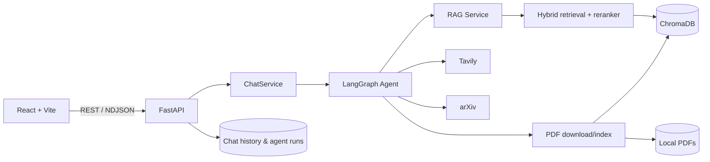

# AI Research Assistant

Trợ lý nghiên cứu học thuật sử dụng Agentic RAG để đọc paper PDF, trả lời có trích dẫn và tự mở rộng nguồn khi dữ liệu cục bộ chưa đủ.

Hệ thống kết hợp thư viện PDF, tìm kiếm hybrid, LangGraph và tìm kiếm web/arXiv trong một giao diện chat có streaming, lịch sử hội thoại và nhật ký hoạt động của agent.

## Tính năng chính

- Tải lên, xem trước và quản lý paper PDF cục bộ.
- Parse, chia chunk, embedding và lưu dữ liệu trong ChromaDB.
- Chunk PDF lưu metadata section như abstract, method, experiments, results, limitations khi detect được heading.
- Truy xuất hybrid giữa vector search và keyword search, có cross-encoder reranking.
- Keyword search dùng BM25 index persistent riêng, tránh đọc toàn bộ Chroma collection ở mỗi truy vấn.
- Hỏi đáp theo một hoặc nhiều paper, kèm nguồn trích dẫn.
- Streaming câu trả lời và trạng thái từng bước của agent.
- Quản lý phiên chat, nguồn tài liệu, lịch sử chạy và research findings.
- Agent run history lưu stop reason, trace, latency, chat/embedding token usage và estimated cost summary.
- API response và streaming events có `X-Request-ID`/`request_id` để trace một request khi debug.
- Đánh giá chất lượng context trước khi trả lời.
- Tìm kiếm Tavily khi kho tri thức cục bộ chưa đủ.
- Tìm paper mới trên arXiv, tải PDF, index và truy xuất lại cho câu hỏi cần thông tin mới.
- Kiểm chứng câu trả lời; có thể lập kế hoạch truy xuất bổ sung khi bằng chứng chưa đạt yêu cầu.

## Kiến trúc



### Luồng Agentic RAG


Agent có thể sử dụng các tool:

- `local_retrieve`: truy xuất từ kho tri thức cục bộ.
- `web_search`: tìm kiếm web bằng Tavily.
- `web_snippet_ingest`: lưu snippet web vào ChromaDB theo phạm vi phiên chat.
- `arxiv_search`: tìm paper mới trên arXiv.
- `pdf_download`: tải PDF được phát hiện.
- `pdf_index`: parse, chunk và index PDF vào vector store.

Endpoint streaming gửi các bước agent ngay khi LangGraph thực thi. Câu trả lời hiện được sinh hoàn chỉnh rồi chia theo từ để truyền dần qua NDJSON; đây chưa phải token streaming trực tiếp từ OpenAI.

## Evaluation Benchmark

Repo có evaluation harness trong `backend/evals/` với 110 cases chia theo factual, comparison, multi-hop, follow-up, unanswerable, fresh research và adversarial prompt-injection/citation-trap scenarios.

Benchmark dưới đây dùng profile deterministic `offline_fixture` để kiểm tra methodology và expected behavior của bốn baseline mà không cần OpenAI, Chroma hay Tavily. Đây không phải kết quả live trên corpus thật; khi dùng làm portfolio cuối cùng, cần chạy thêm profile `live` trên dữ liệu PDF đã index.

```bash
cd backend
python evals/run_eval.py --profile offline_fixture --mode all --output evals/results/offline_fixture_results.json --report-output evals/results/offline_fixture_report.md
```

| Mode | Cases | Answer recall | Citation precision | Citation recall | Retrieval recall | Abstention acc. | p50 latency | p95 latency |
| --- | ---: | ---: | ---: | ---: | ---: | ---: | ---: | ---: |
| `vector_only_rag` | 110 | 0.545 | 0.727 | 0.591 | 0.591 | 0.773 | 180 ms | 180 ms |
| `hybrid_rag` | 110 | 0.727 | 0.909 | 0.727 | 0.909 | 0.909 | 260 ms | 260 ms |
| `hybrid_rerank_rag` | 110 | 0.864 | 0.864 | 0.909 | 0.909 | 0.909 | 430 ms | 430 ms |
| `full_agentic_rag` | 110 | 0.982 | 0.991 | 0.991 | 0.991 | 0.991 | 620 ms | 780 ms |

Ngoài ra có profile `local_fixture` để index fixture chunks vào Chroma tạm thời và chạy retrieval/agent workflow thật mà không cần external API:

```bash
cd backend
python evals/run_eval.py --dataset tests/fixtures/eval_cases.jsonl --profile local_fixture --mode all --output evals/results/local_fixture_results.json --report-output evals/results/local_fixture_report.md
```

Kết quả hiện tại trên 2 fixture cases: `full_agentic_rag` đạt citation precision `1.000`, retrieval recall `1.000`, abstention accuracy `1.000`; các baseline non-agentic đạt retrieval recall `1.000` nhưng citation precision `0.250` do không qua verifier/grounding agentic đầy đủ.

Các báo cáo markdown có thể đọc trực tiếp tại `backend/evals/results/offline_fixture_report.md` và `backend/evals/results/local_fixture_report.md`.

## Demo Trace

Ví dụ trace rút gọn cho câu hỏi thiếu context cục bộ và cần agent tự mở rộng bằng web:

```json
[
  {"stage": "query_planning", "query_type": "comparison", "reason": "question_compares_multiple_items"},
  {"stage": "retrieval_planning", "retrieval_mode": "comparative", "per_query_top_k": 4, "max_total_chunks": 12},
  {"stage": "local_retrieve", "success": true, "chunk_count": 0, "query_count": 4},
  {"stage": "quality_gate", "sufficient": false, "reason": "no_local_context"},
  {"stage": "plan", "planner_source": "heuristic", "selected_tools": ["web_search", "web_snippet_ingest"], "step_count": 2},
  {"stage": "execute_tool", "tool_name": "web_search", "success": true, "latency_ms": 412},
  {"stage": "observe", "tool_name": "web_search", "chunk_count": 3},
  {"stage": "quality_gate", "sufficient": true, "reason": "external_evidence_available"},
  {"stage": "generate_answer", "latency_ms": 1380, "input_tokens": 2100, "output_tokens": 220, "estimated_cost_usd": 0.0012},
  {"stage": "verify_answer", "success": true, "supported_claim_count": 2, "contradicted_claim_count": 0}
]
```

Trace đầy đủ được lưu trong agent run history và hiển thị trong Agent Memory panel của frontend.

## Công nghệ

| Thành phần | Công nghệ |
| --- | --- |
| Frontend | React 19, Vite 7, Lucide React |
| Backend | Python 3.11+, FastAPI, Pydantic, Uvicorn |
| Agent | LangGraph |
| LLM và embedding | OpenAI API |
| Vector store | ChromaDB |
| Retrieval | Vector + keyword, Sentence Transformers cross-encoder |
| Xử lý PDF | PyMuPDF |
| Nguồn bên ngoài | Tavily, arXiv |
| Kiểm thử | Pytest, Ruff, ESLint |

## Cấu trúc dự án

```text
AI Research Assistant/
├── backend/
│   ├── app/
│   │   ├── agent/          # LangGraph, node, evaluator, prompt và tool
│   │   ├── api/            # FastAPI router và dependency
│   │   ├── config/         # Cấu hình ứng dụng
│   │   ├── models/         # Pydantic models
│   │   ├── parser/         # Parse, làm sạch và chia chunk PDF
│   │   ├── services/       # LLM, RAG, retrieval, PDF, web và arXiv
│   │   ├── storage/        # Lịch sử chat và agent runs dạng JSON
│   │   └── vectorstore/    # ChromaDB và indexing
│   ├── data/               # Dữ liệu runtime cục bộ
│   ├── docs/               # Ghi chú kiến trúc, API và workflow
│   └── tests/
├── frontend/
│   ├── src/
│   │   ├── components/
│   │   ├── pages/
│   │   └── api.js
│   └── Dockerfile
├── docker-compose.yml
└── README.md
```

## Yêu cầu

- Python 3.11 trở lên.
- Node.js `^20.19.0` hoặc `>=22.12.0` nếu chạy frontend trực tiếp.
- Docker và Docker Compose nếu chạy bằng container.
- OpenAI API key để chat, đánh giá context và tạo embedding.
- Tavily API key nếu bật web search fallback.

## Cài đặt và chạy local

### 1. Backend

```powershell
cd backend
python -m venv .venv
.\.venv\Scripts\Activate.ps1
pip install -e ".[dev]"
Copy-Item .env.example .env
```

Trên macOS/Linux, kích hoạt môi trường bằng:

```bash
source .venv/bin/activate
cp .env.example .env
```

Điền ít nhất `OPENAI_API_KEY` trong `backend/.env`, sau đó khởi động API:

```bash
python -m app.main
```

Backend chạy tại `http://localhost:8000`:

- Swagger UI: `http://localhost:8000/docs`
- OpenAPI JSON: `http://localhost:8000/openapi.json`
- Health check: `http://localhost:8000/api/v1/health`

### 2. Frontend

Mở terminal khác:

```bash
cd frontend
npm ci
npm run dev
```

Giao diện chạy tại `http://localhost:5173` và mặc định gọi API tại `http://localhost:8000/api/v1`.

Để dùng backend khác, tạo `frontend/.env.local`:

```env
VITE_API_BASE_URL=http://localhost:8000/api/v1
```

## Chạy bằng Docker

Từ thư mục gốc của dự án:

```powershell
Copy-Item backend/.env.example backend/.env
# Điền OPENAI_API_KEY và TAVILY_API_KEY nếu cần
docker compose up --build
```

Trên macOS/Linux:

```bash
cp backend/.env.example backend/.env
docker compose up --build
```

Các dịch vụ:

| Dịch vụ | URL |
| --- | --- |
| Frontend | http://localhost:5173 |
| Backend API | http://localhost:8000/api/v1 |
| Swagger UI | http://localhost:8000/docs |

Docker Compose ở thư mục gốc mount riêng `backend/data:/app/data`, vì vậy dữ liệu runtime được giữ tại `backend/data/` nhưng source code trong image không bị bind-mount đè lên khi chạy container.

Nếu chỉ cần backend:

```bash
cd backend/docker
docker compose up --build
```

## Cấu hình môi trường

Backend đọc biến môi trường từ `backend/.env`.

| Biến | Mặc định | Ý nghĩa |
| --- | --- | --- |
| `APP_NAME` | `AI Research Assistant` | Tên hiển thị trong OpenAPI |
| `APP_VERSION` | `0.1.0` | Phiên bản API |
| `API_PREFIX` | `/api/v1` | Prefix của các endpoint |
| `OPENAI_API_KEY` | trống | API key cho LLM và embedding |
| `OPENAI_CHAT_MODEL` | `gpt-4.1-mini` | Model sinh và đánh giá câu trả lời |
| `OPENAI_EMBEDDING_MODEL` | `text-embedding-3-small` | Model embedding |
| `OPENAI_CHAT_INPUT_COST_PER_1M` | `0.0` | Chi phí input token trên 1 triệu token cho trace/eval cost estimate |
| `OPENAI_CHAT_OUTPUT_COST_PER_1M` | `0.0` | Chi phí output token trên 1 triệu token cho trace/eval cost estimate |
| `OPENAI_EMBEDDING_COST_PER_1M` | `0.0` | Chi phí embedding trên 1 triệu token cho trace/eval cost estimate |
| `WEB_SEARCH_COST_USD` | `0.0` | Chi phí ước tính cho mỗi lần gọi `web_search` |
| `ARXIV_SEARCH_COST_USD` | `0.0` | Chi phí ước tính cho mỗi lần gọi `arxiv_search` |
| `PDF_DOWNLOAD_COST_USD` | `0.0` | Chi phí ước tính cho mỗi lần gọi `pdf_download` |
| `PDF_INDEX_COST_USD` | `0.0` | Chi phí ước tính cho mỗi lần gọi `pdf_index`, chưa gồm embedding cost riêng |
| `WEB_SNIPPET_INGEST_COST_USD` | `0.0` | Chi phí ước tính cho mỗi lần gọi `web_snippet_ingest`, chưa gồm embedding cost riêng |
| `LOCAL_RETRIEVE_COST_USD` | `0.0` | Chi phí ước tính cho mỗi lần gọi `local_retrieve`, chưa gồm embedding cost riêng |
| `TAVILY_API_KEY` | trống | API key cho web search |
| `API_KEY` | trống | Nếu set, backend yêu cầu `X-API-Key` hoặc `Authorization: Bearer` cho API endpoints |
| `API_RATE_LIMIT_PER_MINUTE` | `0` | Giới hạn request/phút theo client hoặc API key; `0` là tắt |
| `LOG_LEVEL` | `INFO` | Mức log backend; request logs dùng JSON và có `request_id` |
| `CORS_ALLOW_ORIGINS` | localhost frontend origins | Danh sách origin CORS, phân tách bằng dấu phẩy |
| `MAX_PDF_DOWNLOAD_BYTES` | `52428800` | Giới hạn kích thước PDF tải từ URL để giảm rủi ro abuse |
| `MAX_PDF_UPLOAD_BYTES` | `26214400` | Giới hạn kích thước mỗi PDF upload từ local |
| `PDF_DOWNLOAD_ALLOWED_DOMAINS` | trống | Nếu set, chỉ cho tải PDF từ các domain trong danh sách, ví dụ `arxiv.org,openreview.net` |
| `ENABLE_LLM_PLANNER` | `false` | Bật planner dùng LLM structured JSON; lỗi parse sẽ fallback heuristic |
| `ENABLE_LLM_VERIFIER` | `false` | Bật LLM claim judge cho semantic verification; lỗi provider sẽ fallback heuristic |
| `DATA_DIR` | `data` | Thư mục lưu PDF, lịch sử và agent runs |
| `CHROMA_DIR` | `data/chroma` | Thư mục ChromaDB |
| `INDEX_LOCAL_PDFS_ON_STARTUP` | `true` | Tự index PDF cục bộ khi backend khởi động |
| `RETRIEVAL_VECTOR_WEIGHT` | `0.65` | Trọng số vector search |
| `RETRIEVAL_KEYWORD_WEIGHT` | `0.35` | Trọng số keyword search |
| `RETRIEVAL_CANDIDATE_MULTIPLIER` | `4` | Hệ số mở rộng tập ứng viên |
| `CROSS_ENCODER_RERANKER_ENABLED` | `true` | Bật cross-encoder reranking |
| `CROSS_ENCODER_RERANKER_MODEL` | `cross-encoder/ms-marco-MiniLM-L-6-v2` | Model reranker |
| `CROSS_ENCODER_FALLBACK_TO_HEURISTIC` | `true` | Dùng heuristic nếu reranker lỗi |

Frontend hỗ trợ `VITE_API_BASE_URL` để đổi địa chỉ backend; mặc định là `http://localhost:8000/api/v1`.

Lưu ý: lần chạy reranker đầu tiên có thể tải model Sentence Transformers về máy. Nếu tải hoặc chạy model thất bại, hệ thống dùng heuristic khi `CROSS_ENCODER_FALLBACK_TO_HEURISTIC=true`.

## Sử dụng

1. Mở trang chủ và tải một hoặc nhiều file PDF.
2. Mở paper để xem trước hoặc chọn chat với paper đó.
3. Tạo phiên chat, thêm/bớt nguồn và đặt câu hỏi.
4. Theo dõi các bước agent trong khi câu trả lời được stream.
5. Kiểm tra citations, lịch sử chạy và research findings sau mỗi lượt.

PDF tải lên ban đầu chỉ được lưu vào `backend/data/pdfs`. File được index khi người dùng thêm paper làm nguồn chat trên giao diện, gọi endpoint index, hoặc khởi động lại backend với `INDEX_LOCAL_PDFS_ON_STARTUP=true`.

## API chính

Base path: `/api/v1`

| Method | Endpoint | Chức năng |
| --- | --- | --- |
| `GET` | `/health` | Kiểm tra trạng thái API |
| `GET` | `/papers` | Placeholder, hiện trả danh sách rỗng |
| `GET` | `/papers/pdfs` | Liệt kê PDF cục bộ |
| `POST` | `/papers/pdfs/upload` | Tải lên nhiều PDF |
| `GET` | `/papers/pdfs/{filename}/content` | Xem nội dung PDF |
| `POST` | `/papers/pdfs/index` | Index một PDF đã tải |
| `POST` | `/papers/download` | Tải PDF từ URL |
| `POST` | `/chat` | Chat dạng JSON |
| `POST` | `/chat/stream` | Chat streaming dạng NDJSON |
| `GET` | `/chat/history` | Liệt kê các cuộc hội thoại |
| `GET` | `/chat/history/{paper_id}` | Đọc lịch sử theo paper |
| `DELETE` | `/chat/history/{paper_id}` | Xóa lịch sử theo paper |
| `POST` | `/chat/sessions` | Tạo phiên chat |
| `GET/PATCH/DELETE` | `/chat/sessions/{chat_id}` | Đọc, đổi tên hoặc xóa phiên |
| `POST` | `/chat/sessions/{chat_id}/sources` | Thêm nguồn vào phiên |
| `DELETE` | `/chat/sessions/{chat_id}/sources/{paper_id}` | Xóa nguồn khỏi phiên |
| `GET` | `/chat/sessions/{chat_id}/runs` | Xem lịch sử chạy agent |
| `GET` | `/chat/sessions/{chat_id}/findings` | Xem research findings |

Schema request/response đầy đủ có tại Swagger UI sau khi backend khởi động.

## Kiểm thử và kiểm tra chất lượng

Tài liệu kỹ thuật bổ sung:

- `backend/docs/agentic_design.md`: state, decision points, planner, tools, verification và giới hạn agentic hiện tại.
- `backend/docs/evaluation.md`: baseline, dataset format, metrics và cách chạy eval.
- `backend/docs/security.md`: rủi ro ingestion và mitigation hiện có.
- `backend/docs/deployment.md`: Docker, health check và production gaps.
- `backend/docs/workflow.md`: flow LangGraph hiện tại.

Backend:

```bash
cd backend
pytest
ruff check .
```

Frontend:

```bash
cd frontend
npm run lint
npm run build
```

## Dữ liệu cục bộ

Theo cấu hình mặc định, hệ thống tạo:

```text
backend/data/
├── pdfs/          # Paper PDF
├── chroma/        # Vector database
├── chat_history/  # Phiên và tin nhắn
├── agent_runs/    # Trace, citations và findings
└── metadata/      # Manifest theo dõi trạng thái index PDF
```

Không commit API key hoặc dữ liệu nghiên cứu nhạy cảm vào repository.
