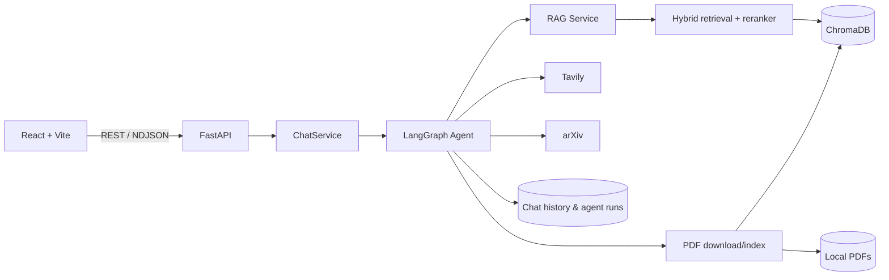
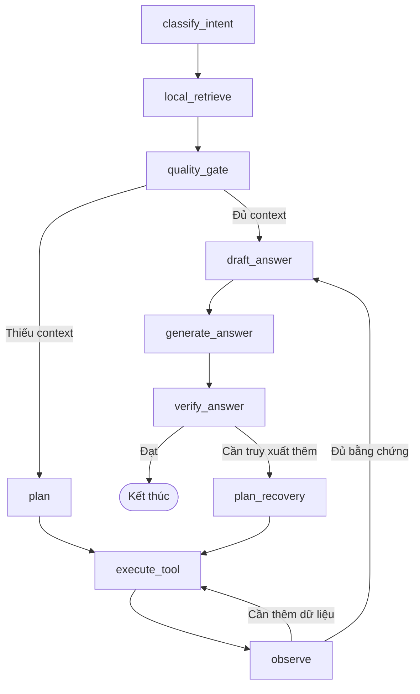

# AI Research Assistant

Trợ lý nghiên cứu học thuật sử dụng Agentic RAG để đọc paper PDF, trả lời có trích dẫn và tự mở rộng nguồn khi dữ liệu cục bộ chưa đủ.

Hệ thống kết hợp thư viện PDF, tìm kiếm hybrid, LangGraph và tìm kiếm web/arXiv trong một giao diện chat có streaming, lịch sử hội thoại và nhật ký hoạt động của agent.

## Tính năng chính

- Tải lên, xem trước và quản lý paper PDF cục bộ.
- Parse, chia chunk, embedding và lưu dữ liệu trong ChromaDB.
- Truy xuất hybrid giữa vector search và keyword search, có cross-encoder reranking.
- Hỏi đáp theo một hoặc nhiều paper, kèm nguồn trích dẫn.
- Streaming câu trả lời và trạng thái từng bước của agent.
- Quản lý phiên chat, nguồn tài liệu, lịch sử chạy và research findings.
- Đánh giá chất lượng context trước khi trả lời.
- Tìm kiếm Tavily khi kho tri thức cục bộ chưa đủ.
- Tìm paper mới trên arXiv, tải PDF, index và truy xuất lại cho câu hỏi cần thông tin mới.
- Kiểm chứng câu trả lời; có thể lập kế hoạch truy xuất bổ sung khi bằng chứng chưa đạt yêu cầu.

## Kiến trúc



### Luồng Agentic RAG



Agent có thể sử dụng các tool:

- `local_retrieve`: truy xuất từ kho tri thức cục bộ.
- `web_search`: tìm kiếm web bằng Tavily.
- `web_snippet_ingest`: lưu snippet web vào ChromaDB theo phạm vi phiên chat.
- `arxiv_search`: tìm paper mới trên arXiv.
- `pdf_download`: tải PDF được phát hiện.
- `pdf_index`: parse, chunk và index PDF vào vector store.

## Công nghệ

| Thành phần | Công nghệ |
| --- | --- |
| Frontend | React 19, Vite 7, Lucide React |
| Backend | Python 3.11+, FastAPI, Pydantic, Uvicorn |
| Agent | LangGraph |
| LLM và embedding | OpenAI API |
| Vector store | ChromaDB |
| Retrieval | Vector + keyword, Sentence Transformers cross-encoder |
| Xử lý PDF | PyMuPDF |
| Nguồn bên ngoài | Tavily, arXiv |
| Kiểm thử | Pytest, Ruff, ESLint |

## Cấu trúc dự án

```text
AI Research Assistant/
├── backend/
│   ├── app/
│   │   ├── agent/          # LangGraph, node, evaluator, prompt và tool
│   │   ├── api/            # FastAPI router và dependency
│   │   ├── config/         # Cấu hình ứng dụng
│   │   ├── models/         # Pydantic models
│   │   ├── parser/         # Parse, làm sạch và chia chunk PDF
│   │   ├── services/       # LLM, RAG, retrieval, PDF, web và arXiv
│   │   ├── storage/        # Lịch sử chat và agent runs dạng JSON
│   │   └── vectorstore/    # ChromaDB và indexing
│   ├── data/               # Dữ liệu runtime cục bộ
│   ├── docs/               # Ghi chú kiến trúc, API và workflow
│   └── tests/
├── frontend/
│   ├── src/
│   │   ├── components/
│   │   ├── pages/
│   │   └── api.js
│   └── Dockerfile
├── docker-compose.yml
└── README.md
```

## Yêu cầu

- Python 3.11 trở lên.
- Node.js 20.19 trở lên nếu chạy frontend trực tiếp.
- Docker và Docker Compose nếu chạy bằng container.
- OpenAI API key để chat, đánh giá context và tạo embedding.
- Tavily API key nếu bật web search fallback.

## Cài đặt và chạy local

### 1. Backend

```powershell
cd backend
python -m venv .venv
.\.venv\Scripts\Activate.ps1
pip install -e ".[dev]"
Copy-Item .env.example .env
```

Trên macOS/Linux, kích hoạt môi trường bằng:

```bash
source .venv/bin/activate
cp .env.example .env
```

Điền ít nhất `OPENAI_API_KEY` trong `backend/.env`, sau đó khởi động API:

```bash
python -m app.main
```

Backend chạy tại `http://localhost:8000`:

- Swagger UI: `http://localhost:8000/docs`
- OpenAPI JSON: `http://localhost:8000/openapi.json`
- Health check: `http://localhost:8000/api/v1/health`

### 2. Frontend

Mở terminal khác:

```bash
cd frontend
npm ci
npm run dev
```

Giao diện chạy tại `http://localhost:5173` và mặc định gọi API tại `http://localhost:8000/api/v1`.

Để dùng backend khác, tạo `frontend/.env.local`:

```env
VITE_API_BASE_URL=http://localhost:8000/api/v1
```

## Chạy bằng Docker

Từ thư mục gốc của dự án:

```powershell
Copy-Item backend/.env.example backend/.env
# Điền OPENAI_API_KEY và TAVILY_API_KEY nếu cần
docker compose up --build
```

Trên macOS/Linux:

```bash
cp backend/.env.example backend/.env
docker compose up --build
```

Các dịch vụ:

| Dịch vụ | URL |
| --- | --- |
| Frontend | http://localhost:5173 |
| Backend API | http://localhost:8000/api/v1 |
| Swagger UI | http://localhost:8000/docs |

Docker Compose ở thư mục gốc mount `backend/` vào container, vì vậy dữ liệu runtime được giữ tại `backend/data/`.

## Cấu hình môi trường

Backend đọc biến môi trường từ `backend/.env`.

| Biến | Mặc định | Ý nghĩa |
| --- | --- | --- |
| `OPENAI_API_KEY` | trống | API key cho LLM và embedding |
| `OPENAI_CHAT_MODEL` | `gpt-4.1-mini` | Model sinh và đánh giá câu trả lời |
| `OPENAI_EMBEDDING_MODEL` | `text-embedding-3-small` | Model embedding |
| `TAVILY_API_KEY` | trống | API key cho web search |
| `DATA_DIR` | `data` | Thư mục lưu PDF, lịch sử và agent runs |
| `CHROMA_DIR` | `data/chroma` | Thư mục ChromaDB |
| `INDEX_LOCAL_PDFS_ON_STARTUP` | `true` | Tự index PDF cục bộ khi backend khởi động |
| `RETRIEVAL_VECTOR_WEIGHT` | `0.65` | Trọng số vector search |
| `RETRIEVAL_KEYWORD_WEIGHT` | `0.35` | Trọng số keyword search |
| `RETRIEVAL_CANDIDATE_MULTIPLIER` | `4` | Hệ số mở rộng tập ứng viên |
| `CROSS_ENCODER_RERANKER_ENABLED` | `true` | Bật cross-encoder reranking |
| `CROSS_ENCODER_RERANKER_MODEL` | `cross-encoder/ms-marco-MiniLM-L-6-v2` | Model reranker |
| `CROSS_ENCODER_FALLBACK_TO_HEURISTIC` | `true` | Dùng heuristic nếu reranker lỗi |

Lưu ý: lần chạy reranker đầu tiên có thể tải model Sentence Transformers về máy.

## Sử dụng

1. Mở trang chủ và tải một hoặc nhiều file PDF.
2. Mở paper để xem trước hoặc chọn chat với paper đó.
3. Tạo phiên chat, thêm/bớt nguồn và đặt câu hỏi.
4. Theo dõi các bước agent trong khi câu trả lời được stream.
5. Kiểm tra citations, lịch sử chạy và research findings sau mỗi lượt.

PDF tải lên chỉ được lưu vào `backend/data/pdfs`. Với cấu hình mặc định, backend sẽ index các file này khi khởi động; API và giao diện cũng hỗ trợ yêu cầu index từng file.

## API chính

Base path: `/api/v1`

| Method | Endpoint | Chức năng |
| --- | --- | --- |
| `GET` | `/health` | Kiểm tra trạng thái API |
| `GET` | `/papers/pdfs` | Liệt kê PDF cục bộ |
| `POST` | `/papers/pdfs/upload` | Tải lên nhiều PDF |
| `GET` | `/papers/pdfs/{filename}/content` | Xem nội dung PDF |
| `POST` | `/papers/pdfs/index` | Index một PDF đã tải |
| `POST` | `/papers/download` | Tải PDF từ URL |
| `POST` | `/chat` | Chat dạng JSON |
| `POST` | `/chat/stream` | Chat streaming dạng NDJSON |
| `GET` | `/chat/history` | Liệt kê các cuộc hội thoại |
| `POST` | `/chat/sessions` | Tạo phiên chat |
| `GET/PATCH/DELETE` | `/chat/sessions/{chat_id}` | Đọc, đổi tên hoặc xóa phiên |
| `POST` | `/chat/sessions/{chat_id}/sources` | Thêm nguồn vào phiên |
| `DELETE` | `/chat/sessions/{chat_id}/sources/{paper_id}` | Xóa nguồn khỏi phiên |
| `GET` | `/chat/sessions/{chat_id}/runs` | Xem lịch sử chạy agent |
| `GET` | `/chat/sessions/{chat_id}/findings` | Xem research findings |

Schema request/response đầy đủ có tại Swagger UI sau khi backend khởi động.

## Kiểm thử và kiểm tra chất lượng

Backend:

```bash
cd backend
pytest
ruff check .
```

Frontend:

```bash
cd frontend
npm run lint
npm run build
```

## Dữ liệu cục bộ

Theo cấu hình mặc định, hệ thống tạo:

```text
backend/data/
├── pdfs/          # Paper PDF
├── chroma/        # Vector database
├── chat_history/  # Phiên và tin nhắn
└── agent_runs/    # Trace, citations và findings
```

Không commit API key hoặc dữ liệu nghiên cứu nhạy cảm vào repository.
