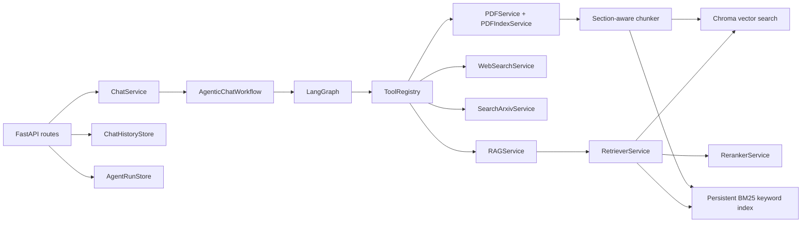

# Backend Architecture

The backend is organized around FastAPI routes, a LangGraph Agentic RAG workflow, service adapters, parser utilities, vector store integrations, and local JSON storage.

## Runtime Layers

- API layer: `backend/app/api/routes/`
- Workflow layer: `backend/app/agent/graph.py`, `backend/app/agent/workflow.py`
- Agent nodes: `backend/app/agent/nodes/`
- Tool layer: `backend/app/agent/tools/`
- Retrieval layer: `backend/app/services/rag_service.py`, `retriever_service.py`, `reranker_service.py`
- Storage/index layer: `backend/app/vectorstore/`, `backend/app/storage/`
- Evaluation layer: `backend/evals/`

## Data Lifecycle

1. PDF upload or download stores files under `data/pdfs`.
2. `PDFIndexService` extracts text, cleans it, chunks it, and attaches page/section metadata.
3. `index_chunks` writes documents to Chroma and the persistent keyword index.
4. Chat retrieval uses vector search, keyword search, hybrid scoring, reranking, and query-anchor filtering.
5. The agent grades context, optionally expands evidence through tools, generates an answer, verifies citations/claims, and persists trace/run records.

## Observability

Every API response includes `X-Request-ID`. If the caller provides the header, the backend preserves it; otherwise the request ID middleware generates one and stores it in request context.

The same middleware accepts W3C `traceparent`, propagates `traceparent`, `X-Trace-ID`, and `X-Span-ID` response headers, and stores trace context in request-scoped context variables. Streaming chat events include `request_id`, `trace_id`, and `span_id` so frontend logs, network traces, and agent events can be correlated while debugging a run.

Agent traces include node stages, tool calls, context quality, selected tools, stop conditions, suspicious context count, answer length, latency, token usage, and estimated cost when provider usage or configured tool-cost estimates are available.

Backend request logs are emitted as JSON with `request_id`, `trace_id`, `span_id`, method, path, status code, and latency. `LOG_LEVEL` controls verbosity.

When `OTEL_ENABLED=true`, `app.observability.tracing.configure_opentelemetry()` instruments FastAPI with OpenTelemetry and exports spans through OTLP HTTP. `OTEL_SERVICE_NAME` and `OTEL_EXPORTER_OTLP_ENDPOINT` control the service name and collector endpoint.

`execute_tool` trace events record tool-call latency on success, handled failure, retry-limit, and unexpected-error paths so slow tool behavior can be separated from LLM generation latency.

`verify_answer` trace events include supported, contradicted, and insufficient claim counts from the claim support judge, plus a compact `claim_citation_map` showing each checked claim, its status, supporting chunk IDs, and judge reason.

Semantic verification is extensible: the default heuristic claim judge runs locally, while `ENABLE_LLM_VERIFIER=true` enables an async LLM claim judge with JSON parsing and heuristic fallback.

Embedding usage is captured by `EmbeddingService` from provider usage metadata. Local retrieval, PDF indexing, and web snippet ingestion propagate embedding model, token count, and estimated embedding cost into tool metadata and trace events. Tool execution also records configurable per-call costs with `tool_estimated_cost_usd` and `estimated_cost_usd`, so external provider/network costs can be included in run-level summaries.

`AgentRunStore` also persists a run-level `usage` summary derived from trace events:

- total observed latency
- input/output/total tokens
- embedding tokens observed during ingest/index operations
- estimated cost
- tool call count
- model names observed in the run

This summary is exposed through `/chat/sessions/{chat_id}/runs` and shown in the frontend agent memory panel.

## Deployment

Docker deployment notes live in `backend/docs/deployment.md`. The root compose file builds immutable backend/frontend images, mounts only runtime data into the backend container, and uses `/api/v1/health` for container health checks.
