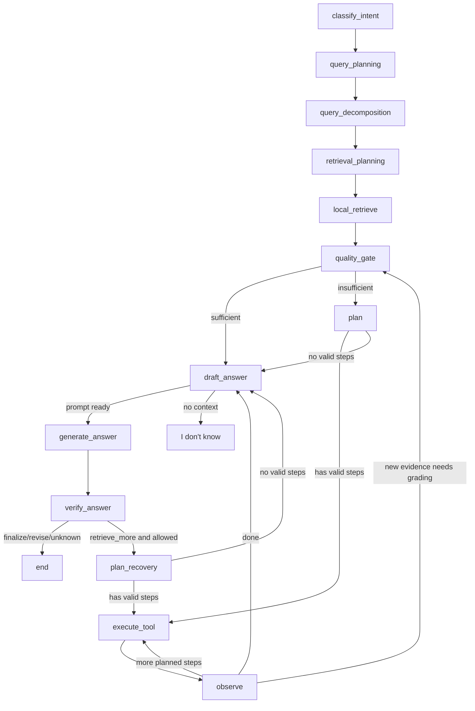

# Workflow

The chat endpoint runs a LangGraph Agentic RAG workflow through `AgenticChatWorkflow`.

## High-Level Flow

## Decision Points

- `classify_intent`: rule-based intent classification using freshness terms and chat history.
- `query_planning`: rule-based query type classification for simple lookup, comparison, multi-aspect, and paper review.
- `query_decomposition`: expands comparison, multi-aspect, and paper review questions into multiple retrieval queries.
- `retrieval_planning`: selects local retrieval mode, per-query `top_k`, score threshold, and max chunk budget before `local_retrieve`.
- `quality_gate`: grades retrieved context using retrieval quality, source count, query coverage, freshness requirements, and optional LLM self-check.
- `plan`: emits a structured `PlannerDecision` with selected tools, stop condition, risk notes, and `planner_source`. By default it uses the heuristic planner; with `ENABLE_LLM_PLANNER=true`, it asks the LLM for the same JSON schema and falls back to heuristic planning on parse/validation failure.
- `observe`: records tool results and routes evidence-producing steps back through `quality_gate` before answer drafting.
- `verify_answer`: applies citation grounding plus claim-level support/contradiction checks, records claim-to-citation mapping, and may request recovery retrieval.
- `_can_retrieve_more`: enforces web-search and agent-step limits before recovery.
- `stream_chat_with_papers`: emits NDJSON `agent_step`, `token`, `citations`, `done`, and structured `error` events. Each event carries `request_id` when request ID middleware is active.

## Tools

Tools are registered in `ToolRegistry` and expose descriptions, input schemas, when-to-use guidance, and failure modes.

- `local_retrieve`: search indexed local PDFs and scoped web-ingested snippets.
- `web_search`: retrieve web snippets/raw content through Tavily.
- `web_snippet_ingest`: persist useful web chunks into the vector store for follow-up retrieval.
- `arxiv_search`: discover recent arXiv papers.
- `pdf_download`: download trusted PDF URLs with URL and size guards.
- `pdf_index`: parse, chunk, embed, and index downloaded PDFs.

## Stopping Reasons

Final responses include a `stop_reason`:

- `answered_with_sufficient_context`
- `answered_after_recovery`
- `no_context_available`
- `web_search_disabled`
- `step_limit_reached`
- `tool_limit_reached`
- `verification_failed_answer_unknown`
- `planner_no_valid_steps`

## Current Limitations

- LLM planning is optional and guarded; the default heuristic planner is still used for deterministic local runs.
- Semantic verification uses an injectable claim judge with heuristic contradiction detection by default. `ENABLE_LLM_VERIFIER=true` enables an LLM JSON judge for claim labels, with heuristic fallback.
- Token/cost tracing is available for chat completion usage, embedding usage, and configurable per-tool external cost estimates. These values are summarized on each persisted agent run.
- `execute_tool` trace events include latency for success, handled failure, retry-limit, and unexpected-error paths.
- Embedding usage is captured for `local_retrieve`, `pdf_index`, and `web_snippet_ingest`. External provider and network-operation costs are configured through `WEB_SEARCH_COST_USD`, `ARXIV_SEARCH_COST_USD`, `PDF_DOWNLOAD_COST_USD`, `PDF_INDEX_COST_USD`, `WEB_SNIPPET_INGEST_COST_USD`, and `LOCAL_RETRIEVE_COST_USD`; keep these at `0.0` when provider pricing is unknown.
- Observability includes request IDs, W3C `traceparent` propagation, JSON request logs with trace IDs, structured stream errors, and optional FastAPI OpenTelemetry instrumentation via `OTEL_ENABLED=true`. A collector/dashboard is still deployment infrastructure, not bundled in the repo.
